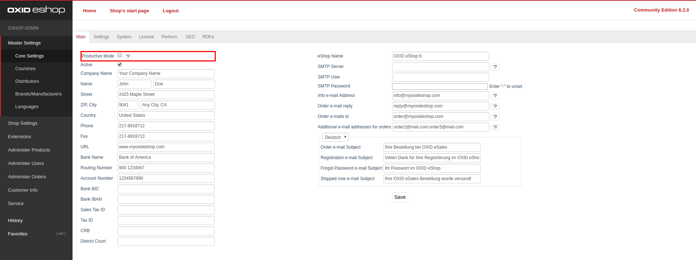

Multi-Admin-Order-Mail-Receiver module
==================

This module adds the possibility for multiple admin order mail receivers to OXID eShop. 

### About the module
Many customers have the problem that, the admin order mail address is bind to one single user.
If the user is not reachable the order mails are also not reachable and no one can process the
incoming orders. So This module adds the possibility to add multiple admin order mail receivers
to the backend. The additional receivers will be added as carbon copy entries to the regular 
admin order mail.



### Compatibility

* The module is OXID eShop 6.2 and higher only
* The module was build and will work on the OXID eShop Community Edition
* The module should work on OXID eShop Professional Edition and OXID eShop Enterprise Edition 
* The module was tested on the OXID eShop Community Edition
* The module wat **not tested** on OXID eShop Professional Edition and OXID eShop Enterprise Edition 


### Requirements

* OXID eShop 6.2 Community Edition (or higher)
* PHP 7.1 (or higher)

### Module installation via composer

* create a new folder called "thirdparty" with the subfolder "pb" at the shop root level (same level as the composer.json)
    * `cd <shop root>`
    * `mkdir -p thirdparty/pb`  
* clone the repository to the new folder
    * `git clone git@github.com:patrick-blom/multi-ordermail-receiver.git thirdparty/pb/MultiOrderMailReceiver` 
* navigate back to the shop root level and add the repository to composer.json
    * `composer config repositories.patrick-blom/multi-ordermail-receiver path thirdparty/pb/MultiOrderMailReceiver`
* add the module to your shop composer.json
    * `composer require patrick-blom/multi-ordermail-receiver`
* prepare the module configuration for eShop 6.2
    * `vendor/bin/oe-console oe:module:install-configuration source/modules/pb/MultiOrderMailReceiver/`
    * `vendor/bin/oe-console oe:module:apply-configuration`
* activate the module
    * `vendor/bin/oe-console oe:module:activate multiordermailreceiver`
* regenerate the unified namespace and the views, because the module adds new database fields
    * `vendor/bin/oe-eshop-unified_namespace_generator`
    * `vendor/bin/oe-eshop-db_views_regenerate`

### Usage

* After the installation and activation you will find a new mail address field called `Additional e-mail addresses for orders` under:
    * `Master Settings -> Core Settings -> Main (right side)`
* The additional mail addresses must be separated by a semicolon (;)
* Only valid mail addresses will be added as carbon copy
* If no address is provided, no carbon copy entry will be set
   
### Testing

#### !Attention!
The testing process should only be done in a development environment or CI pipeline.

#### Preparing
* Install the module as described
* Prepare the [OXID Testing Library](https://github.com/OXID-eSales/testing_library) likes described in their repository 
or use the [oxvm_eshop](https://github.com/OXID-eSales/oxvm_eshop) / [docker-eshop-sdk](https://github.com/OXID-eSales/docker-eshop-sdk)
* Add `pb/MultiOrderMailReceiver` to the partial module paths in your test_config.yml (e.g: `partial_module_paths: 'pb/MultiOrderMailReceiver'`)
* Copy the `config.inc.TEST.php.dist` to your shop root and rename it to `config.inc.TEST.php`
* Adjust the settings in the `config.inc.TEST.php` to your needs (test database name, error reporting, etc)
* Modify your `config.inc.php` and ensure that the `config.inc.TEST.php` will be loaded during the tests
```php
    // bottom of config.inc.php
    if (defined('OXID_PHP_UNIT')) {
        include "config.inc.TEST.php";
    }
```

#### Run tests
* Navigate to the shop root
* Run the test using the following command: `php vendor/bin/runtests <absolute path to shop root>/source/modules/pb/MultiOrderMailReceiver/Tests`
* Run the coverage using the following command: `php vendor/bin/runtests-coverage <absolute path to shop root>/source/modules/pb/MultiOrderMailReceiver/Tests`


### License
The module is released under GPL-3.0. For a full overview check the [LICENSE](LICENSE) file.
